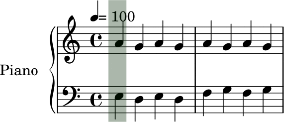

# Finding the top and bottom of systems

In order to provide for a smooth transition of the cursor that looks linear, the software has to know the limits of the current
system (a system is the set of staves played together). Compare the following two cursor progression below:

| cursor only around notes | cursor going from top to bottom of the system |
|:---------:|:---------:|
|  |  |


To find the top and bottom of a system, I used a debug option from lilypond: skylines.
When passing the option `-ddebug-skylines` to lilypond, it generates some visual clues in the output
which are normally used for debugging. On the following image, we can see some colored lines on top and
bottom of the staves.


There are two purple-ish lines, one on top of each staff, and two turquoise ones at the bottom. There are
also two other lines which can't be seen as they are drawn below the top purple bottom turquoise ones.

The top line that is not visible is red, and the bottom one is green. These are the top and bottom and
bottom line of the system (which comprise only two staves in this example).

When opening the generated svg file, we can see the following:

```svg
<g color="rgb(0.0%, 25500.0%, 0.0%)">
<line transform="translate(5.6906, 3.8453)" stroke-linejoin="round" stroke-linecap="round" stroke-width="0.1000" stroke="currentColor" x1="42.8096" y1="8.0873" x2="42.8096" y2="8.0873"/>
...
<line transform="translate(5.6906, 3.8453)" stroke-linejoin="round" stroke-linecap="round" stroke-width="0.1000" stroke="currentColor" x1="42.8096" y1="17.0373" x2="42.8096" y2="8.0873"/>
...
<line transform="translate(5.6906, 3.8453)" stroke-linejoin="round" stroke-linecap="round" stroke-width="0.1000" stroke="currentColor" x1="42.8096" y1="17.0373" x2="42.8096" y2="17.0373"/>
...
</g>
```

Each `line` element inside a `g` group is a small segment of the `g` line. Using the translate and the `x1`,
`y1`, `x2`, `y2` coordinates, we can reconstruct all the lines segment and thus the whole line. Using these
coordinates it is then possible to compute the top most and bottom most segment, giving us the top and bottom
of a line. The color in `g` element is then used to decide if the line is following the top or bottom of a
staff, or the top of bottom of the system. Since we are interested here to fing the limits of a system, the
lines that are of interest for us are the red ones (top system, color "rgb(25500.0%, 0.0%, 0.0%)") and green
ones (bottom system, color "rgb(0.0%, 25500.0%, 0.0%)")

Using these we can now extract all the top and bottom limits of the systems appearing in a music sheet. This is
then later used as the top and bottom of the cursor as can be seen in the following example:



Since the goal of the project is to use real music sheets, the colored lines have to be removed. This is done
simply by rerunning lilypond without the debug option. However, since running lilypond takes some time, it
would very likely be faster to remove the colored lines out of the the svg files than re-running lilypond.
I haven't implemented this optimisation yet.
