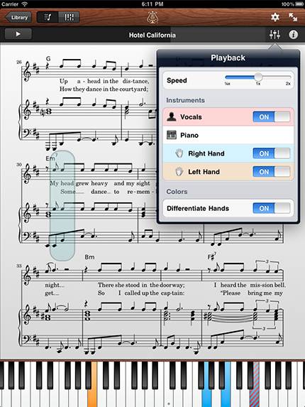

# Getting the staff's instrument name

In order to let the user play only left or right hand, I wanted to provide a small window on which the user
could simply select the part he wanted. I had in mind to provide a similar user interface as the one from
[Etude](http://etudeapp.com/tour/). The following image was more or less what I wanted to provide:



With lilypond, it is possible to name the staves. For example, on the following example, the first stave is named
"Pit" and the second one "Herr"


I wanted to reuse these names (thus extract them from the music sheet) in the select part window. Note: I didn't implemented
the "select part" option in the player.

To do so, I simply got them from the event listener. We already saw how we got the staff number, when receiving a note head event.
Lilypond also provides a function `get-instrument-name` which can be called at the same place. That way, it is possible to know
which name (if any) correspond to a specific staff number, and therefore provide the functionality of letting the user select
a part of music by the instrument name.

The code look as follow:
```
#(define (save-staff-number-instrument-name staff-number context)
	 (output-to-table-file (ly:format "~a ~a"
					  staff-number
					  (get-instrument-name context))))

#(define (on-note-head engraver grob source-engraver)
   (let* ((context  (ly:translator-context source-engraver))

	  (root-context (object-address (ly:context-property-where-defined context 'instrumentName)))
	  (staff-number (get-staff-number root-context))

 	  (save-staff-number-instrument-name staff-number context)
	...
)))

\layout {
  \context {
    \Voice

    \consists #(make-engraver
		(acknowledgers
		 ((note-head-interface engraver grob source-engraver)
		  (on-note-head engraver grob source-engraver))))
  }
}
```

In hindsight, this part was probably useless, because no ones ever set the names of these staves in a music sheet.
